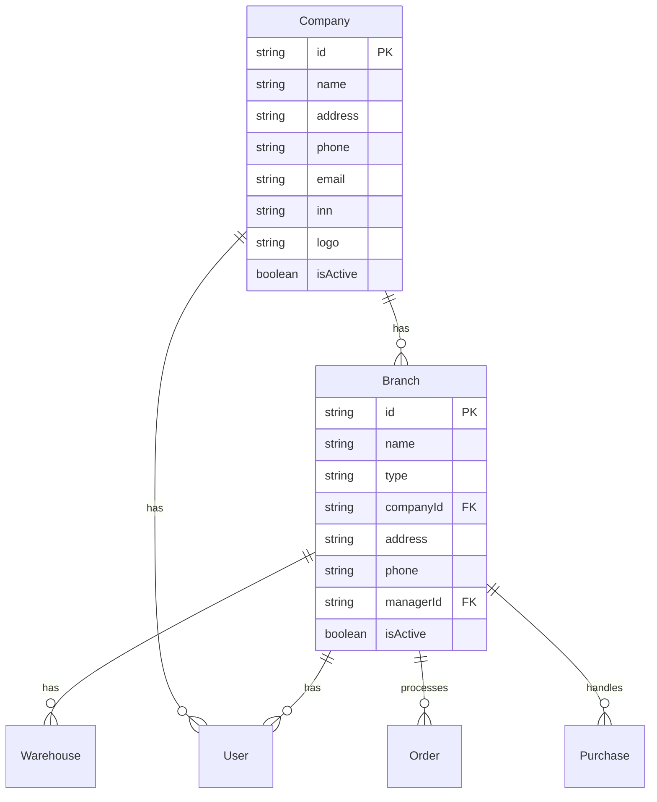
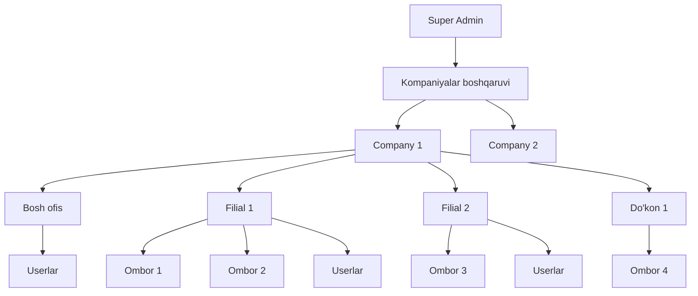
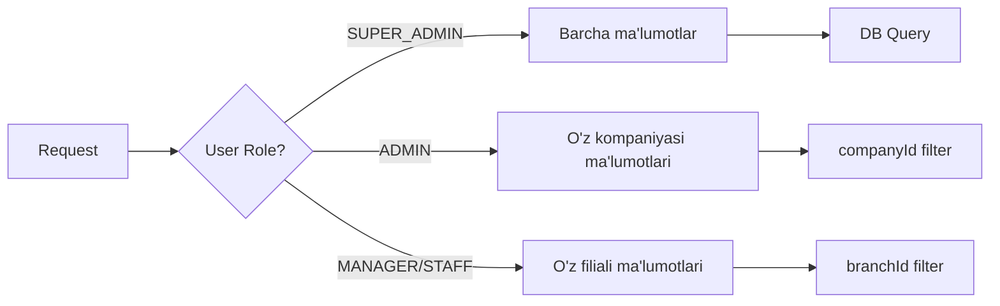

# WAREFLOW ERP — Professional Architecture Plan

## 📋 Loyiha Tahlili

**Texnologiyalar:** Next.js 14, Prisma 7, PostgreSQL, NextAuth, Redux, Tailwind CSS, Recharts  
**Maqsad:** Omborlarni boshqarish tizimi — real product, odamlar foydalanadi

---

## 🔍 TOPILGAN MUAMMOLAR VA BUGLAR

### BUG #1: Purchases da narxni o'zgartirib bo'lmaydi
**Fayl:** `app/(dashboard)/purchases/page.tsx` (qator 255-278)  
**Muammo:** Cartga mahsulot qo'shilganda narx `product.wholesalePrice || product.sellPrice` dan olinadi, lekin cartda narxni tahrirlash uchun **hech qanday input yo'q**. Faqat miqdor o'zgartiriladi.  
**Yechim:** Har bir cart itemga editable price input qo'shish kerak.

### BUG #2: Sales da ham narxni o'zgartirib bo'lmaydi
**Fayl:** `app/(dashboard)/sales/page.tsx` (qator 338-361)  
**Muammo:** Purchases bilan bir xil — cartda faqat miqdor o'zgartiriladi, narx emas.  
**Yechim:** Sales cartga ham editable price input qo'shish.

### BUG #3: Orders API da duplicate batch include
**Fayl:** `app/api/orders/route.ts` (qator 55-56 va 141-142)  
**Muammo:** `batch` maydoni 2 marta include qilingan:
```typescript
batch: { select: { id: true, batchNumber: true, expiryDate: true } },
batch: { select: { id: true, batchNumber: true, expiryDate: true } },
```
Bu Prisma da xato yoki kutilmagan natija beradi.  
**Yechim:** Duplicate ni o'chirish.

### BUG #4: SUPER_ADMIN roli yo'q
**Fayl:** `prisma/schema.prisma` (qator 430-434)  
**Muammo:** `UserRole` enum da faqat `ADMIN, MANAGER, STAFF` bor, lekin `app/api/tenants/route.ts` `SUPER_ADMIN` ni tekshiradi.  
**Yechim:** Schema ga `SUPER_ADMIN` qo'shish yoki tenants API ni `ADMIN` ga o'zgartirish.

### BUG #5: Company-based data isolation yo'q
**Muammo:** Barcha API route lar ma'lumotlarni company bo'yicha filterlamaydi. Masalan, `GET /api/products` barcha productlarni qaytaradi, user ning `companyId` siga qaramasdan. Bu multi-tenant tizimda jiddiy xavfsizlik muammosi.  
**Yechim:** Har bir API route ga company filter qo'shish.

### BUG #6: Orders API [id] route da params formati eski
**Fayl:** `app/api/orders/[id]/route.ts` (qator 6)  
**Muammo:** `{ params }: { params: { id: string } }` — Next.js 15 da params Promise bo'lishi kerak. Purchases API da to'g'ri: `{ params }: { params: Promise<{ id: string }> }`  
**Yechim:** Promise formatga o'tkazish.

---

## 🏢 ENTERPRISE / KORXONALAR MODULI

### Hozirgi holat:
- `app/(dashboard)/enterprises/page.tsx` — "Tez kunda!" placeholder, hech qanday funksionallik yo'q
- `Company` model schema da mavjud lekin deyarli ishlatilmaydi
- `app/api/tenants/` API bor lekin u boshqa page ga bog'langan

### Nimadir qilish kerak:

#### 1. Schema o'zgarishlari — Branch/Filial modeli



#### 2. Enterprise moduli funksionalligi

| Funksiya | Tavsif |
|----------|--------|
| Kompaniya CRUD | Kompaniya ma'lumotlarini boshqarish |
| Filial CRUD | Filial qo'shish, tahrirlash, o'chirish |
| Filial turlari | Bosh ofis, Filial, Do'kon, Ombor |
| Filial-Warehouse bog'lash | Har bir filial o'z omborlariga ega |
| Filial-User bog'lash | Xodimlarni filialga biriktirish |
| Filiallararo transfer | Filiallar o'rtasida mahsulot ko'chirish |
| Filial hisobotlari | Har bir filial bo'yicha alohida hisobot |

#### 3. Enterprise UI sahifalari

```
/enterprises                    — Kompaniya va filiallar ro'yxati
/enterprises/[id]               — Kompaniya tafsilotlari
/enterprises/branches/add       — Yangi filial qo'shish
/enterprises/branches/[id]      — Filial tafsilotlari va tahrirlash
```

---

## 🏗️ MULTI-FILIAL ARXITEKTURASI

### Arxitektura diagrammasi:



### Data Isolation Strategy:



---

## 📝 BATAFSIL VAZIFALAR

### Phase 1: Bug Fixes — Mavjud funksiyalarni to'g'rilash

| # | Vazifa | Fayl | Muhimlik |
|---|--------|------|----------|
| 1.1 | Purchases cartga price input qo'shish | `purchases/page.tsx` | 🔴 Kritik |
| 1.2 | Sales cartga price input qo'shish | `sales/page.tsx` | 🔴 Kritik |
| 1.3 | Orders API duplicate batch include ni o'chirish | `api/orders/route.ts` | 🟡 Muhim |
| 1.4 | Orders API [id] params ni Promise formatga o'tkazish | `api/orders/[id]/route.ts` | 🟡 Muhim |
| 1.5 | SUPER_ADMIN rol qo'shish yoki tenants API ni to'g'rilash | `schema.prisma` + `tenants/route.ts` | 🟡 Muhim |

### Phase 2: Enterprise / Korxonalar moduli

| # | Vazifa | Tavsif |
|---|--------|--------|
| 2.1 | Schema: Branch model qo'shish | name, type, companyId, address, phone, managerId, isActive |
| 2.2 | Schema: Warehouse ga branchId qo'shish | Warehouse ni branch ga bog'lash |
| 2.3 | Schema: User ga branchId qo'shish | User ni branch ga bog'lash |
| 2.4 | API: `/api/branches` CRUD | Branch API route larini yaratish |
| 2.5 | API: `/api/companies/[id]` detail | Kompaniya tafsilotlari API |
| 2.6 | UI: Enterprises ro'yxat sahifasi | Kompaniya va filiallar ro'yxati |
| 2.7 | UI: Branch qo'shish/tahrirlash formasi | Filial CRUD formasi |
| 2.8 | UI: Branch tafsilotlari sahifasi | Filial statistikasi va sozlamalari |

### Phase 3: Multi-filial Data Isolation

| # | Vazifa | Tavsif |
|---|--------|--------|
| 3.1 | Auth: Session ga companyId va branchId qo'shish | JWT token va session ga company/branch ma'lumotlari |
| 3.2 | Middleware: Company-based filtering | checkPermission funksiyasini kengaytirish |
| 3.3 | API: Barcha GET route larga company filter | Products, Orders, Purchases, Customers, etc. |
| 3.4 | API: Barcha POST route larga company validation | Yaratishda company ni avtomatik qo'shish |
| 3.5 | UI: Warehouse selector ga branch filter | Faqat o'z filiali omborlarini ko'rsatish |

### Phase 4: Qo'shimcha funksionallik

| # | Vazifa | Tavsif |
|---|--------|--------|
| 4.1 | Filiallararo transfer | Branch lar o'rtasida mahsulot ko'chirish |
| 4.2 | Filial hisobotlari | Har bir branch bo'yicha alohida hisobot |
| 4.3 | Dashboard da branch selector | Filialni tanlab ko'rish imkoniyati |
| 4.4 | Konsolidirlangan hisobot | Barcha filiallar bo'yicha umumiy hisobot |

---

## ⚠️ Ta'sir qiluvchi fayllar ro'yxati

### Schema o'zgarishlari:
- `prisma/schema.prisma` — Branch model, User/Warehouse o'zgarishlari

### Backend API:
- `app/api/purchases/route.ts` — price ni qabul qilish
- `app/api/orders/route.ts` — duplicate batch fix, params fix
- `app/api/orders/[id]/route.ts` — params Promise format
- `app/api/warehouses/route.ts` — branch filter
- `app/api/products/route.ts` — company filter
- `app/api/branches/` — YANGI: Branch CRUD API
- `lib/auth.ts` — companyId, branchId session ga qo'shish
- `lib/checkPermission.ts` — company isolation logic

### Frontend:
- `app/(dashboard)/purchases/page.tsx` — price input qo'shish
- `app/(dashboard)/sales/page.tsx` — price input qo'shish
- `app/(dashboard)/enterprises/page.tsx` — to'liq qayta yozish
- `components/Sidebar.tsx` — enterprises submenu yangilash

### Migration:
- `prisma/migrations/` — Yangi migration yaratish

---

## 🎯 Implementatsiya tartibi

1. **Avval Bug Fixes** — Mavjud funksiyalar to'g'ri ishlashi kerak
2. **Keyin Schema o'zgarishlari** — Branch model va migration
3. **So'ngra Enterprise UI** — Korxonalar moduli
4. **Oxirda Data Isolation** — Multi-tenant filtering
