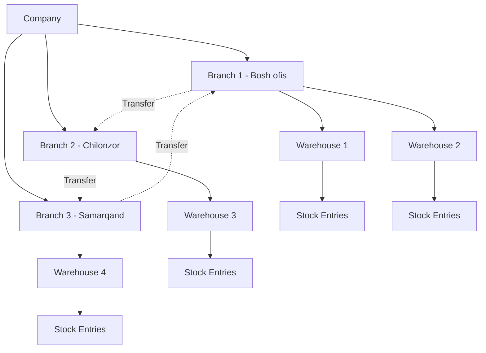
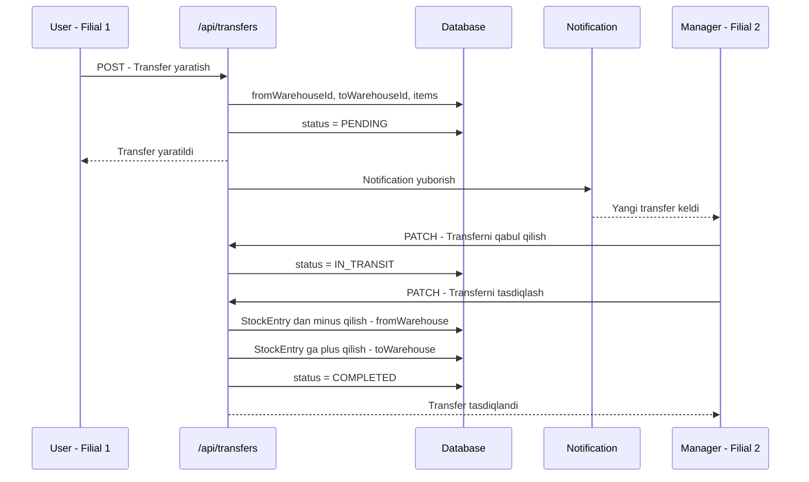
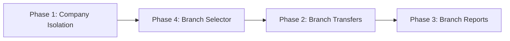

# 🏗️ Multi-Branch Architecture Plan — IBOX ERP

## 📋 Executive Summary

Loyihada Company → Branch → Warehouse ierarxiyasi mavjud, lekin hozircha **ma'lumotlar kompaniya bo'yicha ajratilmagan**. Ushbu plan 4 ta asosiy vazifani hal qiladi:

1. **Company-based data isolation** — Barcha API routelarda company filtri
2. **Inter-branch transfers** — Filiallar o'rtasida mahsulot ko'chirish
3. **Branch reports** — Har bir filial bo'yicha alohida hisobot
4. **Dashboard branch selector** — Filialni tanlab ko'rish

---

## 🔍 Current State Analysis

### Nima mavjud:
| Komponent | Holat |
|-----------|-------|
| `Company` modeli | ✅ Mavjud, `id`, `name`, `branches`, `warehouses`, `users` |
| `Branch` modeli | ✅ Mavjud, `companyId`, `managerId`, `warehouses`, `users` |
| `Warehouse` modeli | ✅ Mavjud, `companyId`, `branchId` |
| `User` modeli | ✅ Mavjud, `companyId`, `branchId`, `warehouseId` |
| JWT session | ✅ `companyId`, `branchId`, `warehouseId` token da bor |
| `/api/branches` | ✅ Company bo'yicha filtrlash mavjud |
| `Transfer` modeli | ⚠️ Faqat warehouse-to-warehouse, branch darajasi yo'q |

### Nima yetishmayapti:
| Muammo | Ta'sir |
|--------|--------|
| `Product`, `Customer`, `Supplier`, `Order`, `Purchase` va boshqa modellarda `companyId` yo'q | ❌ Kompaniya ma'lumotlari aralashib ketadi |
| API routelarda company filtri yo'q | ❌ Har qanday user barcha ma'lumotlarni ko'radi |
| Dashboard da branch selector yo'q | ❌ Filial bo'yicha ko'rish imkoni yo'q |
| Branch hisobotlari mavjud emas | ❌ Filial darajasida analitika yo'q |
| Branch transfer UI mavjud emas | ❌ Filiallar o'rtasida ko'chirish qo'lda |

---

## 🏛️ Architecture Overview



---

## 📦 Phase 1: Company-Based Data Isolation

### 1.1 Prisma Schema Changes

Quyidagi modellarga `companyId` maydoni qo'shiladi:

```
Model                  | companyId | branchId | Izoh
-----------------------|-----------|----------|---------------------------
Product                | ✅ +       | -        | Kompaniya mahsulotlari
Category               | ✅ +       | -        | Kompaniya kategoriyalari
Folder                 | ✅ +       | -        | Kompaniya papkalari
Unit                   | ✅ +       | -        | Kompaniya o'lchov birliklari
Customer               | ✅ +       | -        | Kompaniya mijozlari
CustomerGroup           | ✅ +       | -        | Kompaniya mijozlar guruhlari
Supplier               | ✅ +       | -        | Kompaniya yetkazib beruvchilari
Order                  | ✅ +       | ✅ +      | Buyurtmalar branch ga bog'lanadi
Purchase               | ✅ +       | ✅ +      | Xaridlar branch ga bog'lanadi
Cashbox                | ✅ +       | ✅ +      | Kassa branch ga bog'lanadi
Transfer               | ✅ +       | -        | Transferlar kompaniya darajasida
PriceList              | ✅ +       | -        | Narx ro'yxatlari
ExpenseCategory        | ✅ +       | -        | Xarajat kategoriyalari
Expense                | ✅ +       | ✅ +      | Xarajatlar branch ga bog'lanadi
SalesAgent             | ✅ +       | -        | Sotuv agentlari
LoyaltyProgram         | ✅ +       | -        | Sodiqlik dasturi
Contract               | ✅ +       | -        | Shartnomalar
ProductBatch           | -          | -        | Warehouse orqali aniqlanadi
StockEntry             | -          | -        | Warehouse orqali aniqlanadi
```

**Migration fayli:** `prisma/migrations/XXXXXX_add_company_isolation/migration.sql`

### 1.2 Company Filter Helper — `lib/getCompanyFilter.ts`

Har bir API route da takrorlanadigan company filtri uchun universal helper:

```typescript
// lib/getCompanyFilter.ts
import { getServerSession } from 'next-auth';
import { authOptions } from '@/lib/auth';

interface CompanyFilterResult {
  companyId: string;
  branchId?: string | null;
  warehouseId?: string | null;
  role: string;
  error?: Response;
}

export async function getCompanyFilter(): Promise<CompanyFilterResult | { error: Response }> {
  const session = await getServerSession(authOptions);
  const user = session?.user as any;

  if (!user) {
    return { error: new Response(JSON.stringify({ error: 'Tizimga kiring' }), { status: 401 }) };
  }

  return {
    companyId: user.companyId,
    branchId: user.branchId,
    warehouseId: user.warehouseId,
    role: user.role,
  };
}

// Prisma where clause builder
export function buildCompanyWhere(user: any, extraFilters?: Record<string, any>) {
  const where: any = { ...extraFilters };
  
  // SUPER_ADMIN sees everything, others see only their company
  if (user.role !== 'SUPER_ADMIN' && user.companyId) {
    where.companyId = user.companyId;
  }
  
  return where;
}
```

### 1.3 API Routes That Need Updating

Har bir API route ga company filtri qo'shish:

| # | Route | Fayl | O'zgarish |
|---|-------|------|-----------|
| 1 | GET/POST products | `app/api/products/route.ts` | `where: { companyId }` |
| 2 | GET/POST categories | `app/api/categories/route.ts` | `where: { companyId }` |
| 3 | GET/POST customers | `app/api/customers/route.ts` | `where: { companyId }` |
| 4 | GET/POST customer-groups | `app/api/customer-groups/route.ts` | `where: { companyId }` |
| 5 | GET/POST suppliers | `app/api/suppliers/route.ts` | `where: { companyId }` |
| 6 | GET/POST orders | `app/api/orders/route.ts` | `where: { companyId }` + branchId |
| 7 | GET/POST purchases | `app/api/purchases/route.ts` | `where: { companyId }` + branchId |
| 8 | GET/POST cashbox | `app/api/cashbox/route.ts` | `where: { companyId }` + branchId |
| 9 | GET/POST transfers | `app/api/warehouse/movements/route.ts` | `where: { companyId }` |
| 10 | GET dashboard/stats | `app/api/dashboard/stats/route.ts` | Full company + branch filter |
| 11 | GET reports/* | `app/api/reports/sales/route.ts` etc. | Company + branch filter |
| 12 | GET/POST price-lists | `app/api/price-lists/route.ts` | `where: { companyId }` |
| 13 | GET/POST sales-agents | `app/api/sales-agents/route.ts` | `where: { companyId }` |
| 14 | GET/POST expenses | `app/api/expense-categories/route.ts` | `where: { companyId }` |
| 15 | GET/POST contracts | `app/api/contracts/route.ts` | `where: { companyId }` |
| 16 | GET stock | `app/api/stock/route.ts` | Via warehouse.companyId |
| 17 | GET/POST product-batches | `app/api/product-batches/route.ts` | Via warehouse.companyId |

### 1.4 `checkPermission` Update

`lib/checkPermission.ts` ga company filter ma'lumotlarini qo'shish:

```typescript
export async function checkPermission(permission: string) {
  const session = await getServerSession(authOptions);
  const user = session?.user as any;

  if (!user) {
    return { error: NextResponse.json({ error: 'Tizimga kiring' }, { status: 401 }), user: null };
  }

  const isAdmin = user.role === 'ADMIN' || user.role === 'SUPER_ADMIN';
  const hasPermission = isAdmin || user.permissions?.includes(permission);

  if (!hasPermission) {
    return { error: NextResponse.json({ error: 'Ruxsat yo\'q' }, { status: 403 }), user: null };
  }

  return { 
    error: null, 
    user: {
      ...user,
      companyId: user.companyId,
      branchId: user.branchId,
      warehouseId: user.warehouseId,
    }
  };
}
```

---

## 🔄 Phase 2: Inter-Branch Transfers

### 2.1 Schema Enhancement

`Transfer` modeliga branch darajasidagi maydonlar qo'shiladi:

```prisma
model Transfer {
  id                String         @id @default(cuid())
  docNumber         String         @unique
  date              DateTime       @default(now())
  responsiblePerson String?
  status            TransferStatus @default(PENDING)
  notes             String?

  // Company isolation
  companyId         String
  company           Company        @relation(fields: [companyId], references: [id])

  // Warehouse level
  fromWarehouseId   String
  fromWarehouse     Warehouse      @relation("TransferFrom", fields: [fromWarehouseId], references: [id])
  toWarehouseId     String
  toWarehouse       Warehouse      @relation("TransferTo", fields: [toWarehouseId], references: [id])

  items             TransferItem[]
  createdAt         DateTime       @default(now())
  updatedAt         DateTime       @updatedAt

  @@index([companyId])
  @@index([fromWarehouseId])
  @@index([toWarehouseId])
  @@index([date])
}
```

### 2.2 Branch Transfer Flow



### 2.3 New/Updated API Routes

| Route | Method | Tavsif |
|-------|--------|--------|
| `/api/transfers` | GET | Barcha transferlar ro'yxati, company filtri bilan |
| `/api/transfers` | POST | Yangi transfer yaratish |
| `/api/transfers/[id]` | GET | Bitta transfer tafsilotlari |
| `/api/transfers/[id]/approve` | PATCH | Transferni tasdiqlash — stockni ko'chirish |
| `/api/transfers/[id]/reject` | PATCH | Transferni rad etish |
| `/api/transfers/[id]/complete` | PATCH | Transferni yakunlash |

### 2.4 Transfer Logic

**Stock ko'chirish algoritmi:**

1. **Yaratish** — `status: PENDING`, hech qanday stock o'zgarmaydi
2. **Jo'natish** — `status: IN_TRANSIT`, manba ombordan stock RESERVED ga o'tadi
3. **Qabul qilish** — `status: COMPLETED`:
   - `fromWarehouse` → `StockEntry.quantity` decrement
   - `toWarehouse` → `StockEntry.quantity` increment (upsert)
   - `ProductBatch` larni ko'chirish (agar batch tracking bo'lsa)
4. **Bekor qilish** — `status: CANCELLED`, reserved stock qaytariladi

### 2.5 Frontend — Branch Transfer Page

Yangi sahifa: `app/(dashboard)/warehouse/transfers/page.tsx`

- Manba filial tanlash → filialning omborlari ko'rinadi
- Maqsad filial tanlash → filialning omborlari ko'rinadi
- Mahsulot qo'shish — manba ombordagi mavjud zaxiradan
- Miqdor kiritish — mavjud zaxiradan ko'p bo'lmasligi kerak
- Jo'natish va tasdiqlash bosqichlari

---

## 📊 Phase 3: Branch Reports

### 3.1 Branch Report API Routes

| Route | Tavsif |
|-------|--------|
| `GET /api/reports/branch-summary?branchId=xxx` | Bitta filial umumiy hisoboti |
| `GET /api/reports/branch-comparison` | Barcha filiallarni taqqoslash |
| `GET /api/reports/sales?branchId=xxx` | Filial savdo hisoboti |
| `GET /api/reports/purchases?branchId=xxx` | Filial xarid hisoboti |
| `GET /api/reports/inventory?branchId=xxx` | Filial qoldiq hisoboti |
| `GET /api/reports/profit-loss?branchId=xxx` | Filial foyda-zarar hisoboti |
| `GET /api/reports/financial?branchId=xxx` | Filial moliyaviy hisoboti |

### 3.2 Branch Report Data Structure

```typescript
interface BranchReport {
  branchId: string;
  branchName: string;
  period: { from: Date; to: Date };
  
  summary: {
    totalSales: number;
    totalPurchases: number;
    totalExpenses: number;
    grossProfit: number;
    netProfit: number;
    orderCount: number;
    averageOrderValue: number;
  };
  
  salesByDate: Array<{ date: string; amount: number; orders: number }>;
  topProducts: Array<{ name: string; quantity: number; revenue: number }>;
  topCustomers: Array<{ name: string; totalSpent: number; orders: number }>;
  stockValue: number;
  cashBalance: { USD: number; UZS: number };
  customerDebt: { USD: number; UZS: number };
  supplierDebt: { USD: number; UZS: number };
}
```

### 3.3 Branch Comparison Report

```typescript
interface BranchComparison {
  branches: Array<{
    branchId: string;
    branchName: string;
    totalSales: number;
    totalPurchases: number;
    profit: number;
    orderCount: number;
    productCount: number;
    stockValue: number;
  }>;
  totals: {
    totalSales: number;
    totalPurchases: number;
    totalProfit: number;
  };
}
```

### 3.4 Frontend — Branch Reports Page

Yangi sahifa: `app/(dashboard)/reports/branch/page.tsx`

- Filial tanlash yoki "Barcha filiallar"
- Dashboard kartochkalar: Savdo, Xarid, Foyda, Qoldiq
- Taqqoslash jadvali: Barcha filiallar bir vaqtda
- Chart: Filiallar bo'yicha savdo grafigi

---

## 🎛️ Phase 4: Dashboard Branch Selector

### 4.1 Branch Context — `lib/BranchContext.tsx`

React Context orqali tanlangan filialni barcha komponentlarda ishlatish:

```typescript
// lib/BranchContext.tsx
'use client';

import { createContext, useContext, useState, useEffect, ReactNode } from 'react';
import { useSession } from 'next-auth/react';

interface Branch {
  id: string;
  name: string;
  type: string;
}

interface BranchContextType {
  selectedBranch: Branch | null;
  branches: Branch[];
  setSelectedBranch: (branch: Branch | null) => void;
  loading: boolean;
}

const BranchContext = createContext<BranchContextType | undefined>(undefined);

export function BranchProvider({ children }: { children: ReactNode }) {
  const { data: session } = useSession();
  const [branches, setBranches] = useState<Branch[]>([]);
  const [selectedBranch, setSelectedBranch] = useState<Branch | null>(null);
  const [loading, setLoading] = useState(true);

  useEffect(() => {
    // Fetch user's branches
    fetch('/api/branches')
      .then(res => res.json())
      .then(data => {
        const branchData = data.data || [];
        setBranches(branchData);
        
        // Auto-select user's branch or first branch
        const userBranchId = (session?.user as any)?.branchId;
        if (userBranchId) {
          const userBranch = branchData.find((b: Branch) => b.id === userBranchId);
          if (userBranch) setSelectedBranch(userBranch);
        } else if (branchData.length > 0) {
          setSelectedBranch(branchData[0]);
        }
      })
      .finally(() => setLoading(false));
  }, [session]);

  return (
    <BranchContext.Provider value={{ selectedBranch, branches, setSelectedBranch, loading }}>
      {children}
    </BranchContext.Provider>
  );
}

export function useBranch() {
  const context = useContext(BranchContext);
  if (!context) throw new Error('useBranch must be used within BranchProvider');
  return context;
}
```

### 4.2 Branch Selector Component — `components/BranchSelector.tsx`

Header ichida filial tanlash dropdowni:

```
┌─────────────────────────────────────────────────────────────────────┐
│  🔍 Qidirish          [📍 Filial: Bosh ofis ▼]   🔔  ⚙️  🌐  👤  │
└─────────────────────────────────────────────────────────────────────┘
```

- SUPER_ADMIN / ADMIN — barcha filiallarni ko'radi
- MANAGER — faqat o'z filialini ko'radi
- STAFF — faqat o'z filialini ko'radi, o'zgartira olmaydi

### 4.3 Layout Update

`app/(dashboard)/layout.tsx` ga `BranchProvider` qo'shiladi:

```typescript
export default function DashboardLayout({ children }) {
  return (
    <NotificationProvider>
      <BranchProvider>
        <div className="flex h-screen ...">
          <Sidebar />
          <div className="flex-1 flex flex-col ...">
            <Header />
            <main>{children}</main>
          </div>
        </div>
      </BranchProvider>
    </NotificationProvider>
  );
}
```

### 4.4 API Integration Pattern

Frontend da API ga murojaat qilishda `branchId` parametri qo'shiladi:

```typescript
// hooks/useBranchApi.ts yoki to'g'ridan-to'g'ri
const { selectedBranch } = useBranch();

// API ga so'rov
const res = await fetch(`/api/orders?branchId=${selectedBranch?.id || ''}`);
const res = await fetch(`/api/dashboard/stats?branchId=${selectedBranch?.id || ''}`);
```

### 4.5 Dashboard Stats Update

`app/api/dashboard/stats/route.ts` ga branch filtri:

```
GET /api/dashboard/stats?branchId=xxx&period=month
```

- `branchId` berilsa → shu filialning omborlari orqali filtrlash
- `branchId` berilmasa → kompaniya bo'yicha umumiy

---

## 🗂️ Implementation Order

Quyidagi tartibda amalga oshiriladi:



**Sabab:** 
- Phase 1 — poydevor, boshqalar bunga tayanadi
- Phase 4 — UI tanlash komponenti, Phase 2 va 3 da kerak
- Phase 2 — Transfer funksiyasi, branch selector bilan integratsiya
- Phase 3 — Hisobotlar, barcha filtrlar tayyor bo'lgandan keyin

---

## 📁 Files to Create/Modify

### Yangi fayllar:

| # | Fayl | Tavsif |
|---|------|--------|
| 1 | `lib/getCompanyFilter.ts` | Company filter helper funksiya |
| 2 | `lib/BranchContext.tsx` | Branch selector React Context |
| 3 | `components/BranchSelector.tsx` | Branch tanlash dropdown komponenti |
| 4 | `app/api/transfers/route.ts` | Transfer CRUD API |
| 5 | `app/api/transfers/[id]/route.ts` | Bitta transfer API |
| 6 | `app/api/transfers/[id]/approve/route.ts` | Transfer tasdiqlash |
| 7 | `app/api/transfers/[id]/complete/route.ts` | Transfer yakunlash |
| 8 | `app/api/reports/branch-summary/route.ts` | Filial hisoboti API |
| 9 | `app/api/reports/branch-comparison/route.ts` | Filial taqqoslash API |
| 10 | `app/(dashboard)/warehouse/transfers/page.tsx` | Branch transfer sahifasi |
| 11 | `app/(dashboard)/reports/branch/page.tsx` | Branch hisobotlari sahifasi |
| 12 | `hooks/useBranchApi.ts` | Branch-aware API hooklari |

### O'zgartiriladigan fayllar:

| # | Fayl | O'zgarish |
|---|------|-----------|
| 1 | `prisma/schema.prisma` | `companyId`, `branchId` maydonlarini qo'shish |
| 2 | `lib/checkPermission.ts` | companyId, branchId qaytarish |
| 3 | `lib/auth.ts` | SUPER_ADMIN rol tan olish |
| 4 | `middleware.ts` | Company-based route protection |
| 5 | `app/(dashboard)/layout.tsx` | BranchProvider qo'shish |
| 6 | `components/Header.tsx` | BranchSelector qo'shish |
| 7 | `components/Sidebar.tsx` | Branch transfer link qo'shish |
| 8 | `app/api/dashboard/stats/route.ts` | Company + Branch filtri |
| 9 | `app/api/orders/route.ts` | Company + Branch filtri |
| 10 | `app/api/purchases/route.ts` | Company + Branch filtri |
| 11 | `app/api/products/route.ts` | Company filtri |
| 12 | `app/api/customers/route.ts` | Company filtri |
| 13 | `app/api/suppliers/route.ts` | Company filtri |
| 14 | `app/api/categories/route.ts` | Company filtri |
| 15 | `app/api/cashbox/route.ts` | Company + Branch filtri |
| 16 | `app/api/reports/sales/route.ts` | Branch filtri |
| 17 | `app/api/reports/purchases/route.ts` | Branch filtri |
| 18 | `app/api/reports/inventory/route.ts` | Branch filtri |
| 19 | `app/api/reports/financial/route.ts` | Branch filtri |
| 20 | `app/api/reports/profit-loss/route.ts` | Branch filtri |
| 21 | `app/api/warehouse/movements/route.ts` | Company filtri |
| 22 | `app/api/stock/route.ts` | Company filtri |
| 23 | `app/api/price-lists/route.ts` | Company filtri |
| 24 | `app/api/sales-agents/route.ts` | Company filtri |
| 25 | `app/api/expense-categories/route.ts` | Company filtri |
| 26 | `app/api/contracts/route.ts` | Company filtri |
| 27 | `app/api/product-batches/route.ts` | Company filtri |

---

## 🔐 Role-Based Access Matrix

| Amal | SUPER_ADMIN | ADMIN | MANAGER | STAFF |
|------|:-----------:|:-----:|:-------:|:-----:|
| Barcha kompaniyalarni ko'rish | ✅ | ❌ | ❌ | ❌ |
| O'z kompaniyasini ko'rish | ✅ | ✅ | ✅ | ✅ |
| Barcha filiallarni ko'rish | ✅ | ✅ | ❌ | ❌ |
| O'z filialini ko'rish | ✅ | ✅ | ✅ | ✅ |
| Filial tanlash - selector | ✅ | ✅ | ❌ | ❌ |
| Branch transfer yaratish | ✅ | ✅ | ✅ | ❌ |
| Branch transfer tasdiqlash | ✅ | ✅ | ✅ | ❌ |
| Branch hisobotlari | ✅ | ✅ | ✅ | ✅ |
| Filial taqqoslash hisoboti | ✅ | ✅ | ❌ | ❌ |

---

## ⚠️ Migration Strategy

### Critical: Existing Data Migration

Yangi `companyId` maydonlari qo'shilganda, mavjud ma'lumotlarni bog'lash kerak:

1. **Yangi migration** — `companyId` maydonlarini `nullable` sifatida qo'shish
2. **Data migration script** — Mavjud ma'lumotlarni to'g'ri kompaniyaga bog'lash
3. **Schema update** — `companyId` ni `nullable` dan `required` ga o'tkazish
4. **Final migration** — Not-null constraint qo'shish

```sql
-- Example data migration
UPDATE "Order" o
SET "companyId" = w."companyId"
FROM "Warehouse" w
WHERE o."warehouseId" = w.id;

UPDATE "Product" p
SET "companyId" = c.id
FROM "Company" c
WHERE c.id = (SELECT "companyId" FROM "Warehouse" LIMIT 1);
```

---

## 🧪 Testing Checklist

- [ ] SUPER_ADMIN barcha kompaniyalar ma'lumotlarini ko'ra oladi
- [ ] ADMIN faqat o'z kompaniyasini ko'radi
- [ ] STAFF faqat o'z filialini ko'radi
- [ ] Branch selector o'zgarganda dashboard yangilanadi
- [ ] Transfer yaratish — stock to'g'ri ko'chiriladi
- [ ] Transfer bekor qilish — stock qaytariladi
- [ ] Branch hisobotlari to'g'ri ma'lumot ko'rsatadi
- [ ] Filiallararo taqqoslash to'g'ri ishlaydi
- [ ] Mavjud ma'lumotlar migration dan keyin to'g'ri ishlaydi
